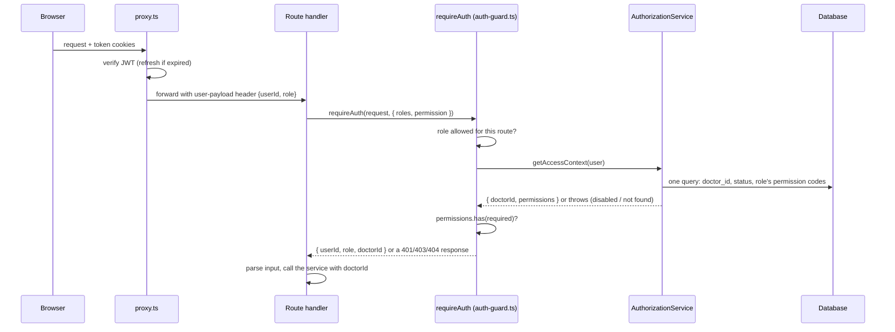
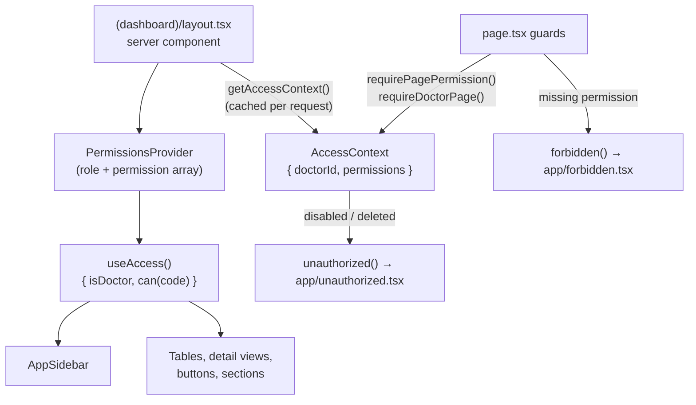

# Role-based access control (RBAC)

This documents how secretaries' access is controlled: what a permission is,
where it is checked, and how the proxy, the API, and the frontend each take
part. It also records what was built and why, so future changes keep the same
guarantees.

> **The one rule to remember:** the **API is the only thing that protects
> data**. The proxy only establishes *who* is calling; the frontend only hides
> what the user can't use. Every permission is checked again, on every
> request, by the route handler.

## Who can do what

- **Doctors** can do everything with their own clinic's data. They are never
  permission-checked, only scoped to their own `doctorId`.
- **Secretaries** belong to one doctor and can do **only** what their **role**
  grants. A secretary with **no role can sign in but can't access anything**
  (deny by default).
- **Roles** are created by each doctor (e.g. "Front Desk", "Billing
  Assistant") and are a set of **per-action permissions** such as
  `PATIENTS_VIEW` or `PAYMENTS_DELETE`.
- **Doctor-only, never grantable:** managing secretaries, managing roles, and
  the doctor's own profile (`/api/secretaries/*`, `/api/roles/*`,
  `/api/doctors/me`).
- **Disabling** a secretary takes effect on their **next request**, even if
  their login token hasn't expired.

## What was built

The database tables existed before this work, but they were barely used:
only `payments/[id]` checked a permission, and it checked `EDIT_PAYMENT`, a
code that didn't exist, so every other route let secretaries do everything.
The work went in six phases:

1. **Permission list in code**: `src/config/permissions.ts` became the single
   source of truth, synced into the database on every deploy.
2. **Data access**: `RoleRepository`, permission lookups, and a one-query
   "access context" for secretaries.
3. **Backend enforcement**: every API route declares the permission it needs.
   This phase also fixed two auth bugs: disabled/deleted users could still log
   in, and token refresh always failed silently.
4. **Role management API**: doctor-only `/api/roles` CRUD.
5. **Frontend**: permissions provider, page guards, sidebar filtering, hidden
   actions, a `/roles` page, and role + enable/disable controls in the
   secretary form.
6. **Tests**: unit tests for the access rules, run in CI before every build.

Along the way, the repositories and services this touched were converted from
static classes to instance classes with constructor-injected dependencies
behind `I…` interfaces (in `src/types/<domain>.ts`), which is what makes the
access rules unit-testable.

## The data model

```text
doctor 1───* role 1───* role_permission *───1 permission
   │           │
   │           └───* secretary (role_id, nullable)
   └───────────────* secretary (doctor_id)
```

- **`permission`**: the global catalog (one row per code). Never edited by
  hand; it mirrors `src/config/permissions.ts`.
- **`role`**: belongs to one doctor. **Names are unique per doctor**
  (`@@unique([doctor_id, name])`), enforced by the database, so two
  simultaneous requests can't both create "Front Desk".
- **`role_permission`**: which permissions a role grants.
- **`secretary.role_id`**: nullable. The foreign key is `ON DELETE SET NULL`,
  so deleting a role would silently leave its secretaries with no access.
  That's why the API **refuses to delete a role that is still assigned** (see
  [Role management API](#role-management-api)).
- **`user.status`**: `ENABLED`, `DISABLED`, or `DELETED` (soft delete). Checked
  at login *and* on every request.

## The permission catalog

`src/config/permissions.ts` defines 17 codes, a human-readable description for
each (used as the checkbox label), and the `PermissionCode` type. Because the
code is a type, a typo like the old `EDIT_PAYMENT` is a compile error.

| Area | Codes |
|---|---|
| Patients | `PATIENTS_VIEW`, `PATIENTS_CREATE`, `PATIENTS_UPDATE`, `PATIENTS_DELETE` |
| Sessions | `SESSIONS_VIEW`, `SESSIONS_CREATE`, `SESSIONS_UPDATE`, `SESSIONS_DELETE` |
| Payments | `PAYMENTS_VIEW`, `PAYMENTS_CREATE`, `PAYMENTS_UPDATE`, `PAYMENTS_DELETE` |
| Images | `IMAGES_UPLOAD`, `IMAGES_UPDATE`, `IMAGES_DELETE` |
| Other | `DASHBOARD_VIEW` (the financial dashboard), `CALENDAR_VIEW` |

The same file also exports:

- `ALL_PERMISSION_CODES`: what doctors get.
- `isPermissionCode()`: narrows strings read from the database; anything not in
  the config is ignored.
- `PERMISSION_GROUPS`: the grouping shown in the roles form, **derived from the
  code prefix**, so a new code can't be accidentally left out of the UI.

### How the database stays in sync

`src/scripts/sync-permissions.ts` makes the `permission` table match the
config exactly, in one transaction: it upserts every code and deletes codes
that are no longer listed (which also removes them from roles; a code nothing
checks grants nothing).

- **On deploy**, it runs automatically: the `migrate` container in
  `docker-compose.yaml` runs `prisma migrate deploy && tsx
  src/scripts/sync-permissions.ts`.
- **Locally**, run `npm run sync-permissions`. It's safe to run repeatedly.
- **The seed** (`src/prisma/seed.ts`) creates the same codes plus three demo
  roles: *Front Desk* (patients and sessions without delete, image upload and
  edit, calendar), *Office Manager* (almost everything except deleting payments
  and the dashboard), and *Billing Assistant* (read-only patients and sessions,
  all payments, the dashboard).

## How a request is authorized



### Step 1: the proxy (authentication only)

**The proxy does not check permissions.** `src/proxy.ts` runs before every
request and only answers "who is this?":

1. Reads the `token` cookie and verifies the JWT. If it's missing or expired
   but a valid `refreshToken` cookie exists, it signs a new token and sets the
   cookie on the response (`AuthResolver`).
2. For pages and listed API routes, removes any `user-payload` header the
   client sent and sets its own: `{"userId": "...", "role": "DOCTOR" |
   "SECRETARY"}`. Route handlers and server components read the user from
   this header.
3. Blocks unauthenticated access:
   - **Pages** are protected by default; only `/login` and `/forgot-password`
     are public. Logged-in users are redirected away from those two.
   - **API routes are public by default**; only the prefixes listed in
     `PROTECTED_API_ROUTES` require a login (`/api/patients`,
     `/api/sessions`, `/api/roles`, …).

**Why permissions are not checked in the proxy or stored in the JWT:** the
token outlives changes. If permissions were in the token, a doctor removing a
permission or disabling a secretary would only take effect when the token
expires. Checking in the route handler costs one indexed query per request
and makes every change immediate. The proxy also stays free of database
access.

> **Security note: register every new authenticated API route in the proxy.**
> For API paths that are in *neither* list, the proxy currently passes the
> request through **without removing a client-supplied `user-payload`
> header**, and `requireAuth` trusts that header. So an authenticated route
> missing from `PROTECTED_API_ROUTES` would accept a **forged identity**. It
> would not return 401. All current routes are covered (verified when this was
> written). The robust fix is a small change: delete the `user-payload` header
> for *every* `/api` request before the early return in `handleApiRoute`.

### Step 2: the route guard

Every protected handler starts with one line:

```ts
const auth = await requireDoctorAuth(request, {
  roles: ["DOCTOR", "SECRETARY"],
  permission: PERMISSIONS.PATIENTS_DELETE,
});
if (auth instanceof NextResponse) return auth; // 401/403/404 already built
// auth.doctorId is the clinic this user works in
```

`src/lib/auth-guard.ts` offers `requireAuth` and `requireDoctorAuth` (the same,
but `doctorId` is always resolved and typed as `string`). Options:

- `roles`: which account types may call the route at all. Doctor-only routes
  use `roles: ["DOCTOR"]`.
- `permission`: the `PermissionCode` required. Doctors always pass.
- `resolveDoctorId`: resolve the clinic without requiring a permission.

**Secretaries are always resolved**, even on routes that need neither a
permission nor a `doctorId` (such as `/api/secretaries/me`), so a disabled
account can't keep using any endpoint. Doctor-only routes that need no
`doctorId` (like `/api/doctors/me`) make no extra query.

### Step 3: the access context

`AuthorizationService.getAccessContext()` (`src/services/authorization.service.ts`)
returns `{ doctorId, permissions: Set<PermissionCode> }`:

- **Doctor**: looks up their doctor profile; gets every permission.
- **Secretary**: **one query** (`SecretaryRepository.getAccessContextByUserId`)
  returns their `doctor_id`, their user `status`, and their role's permission
  codes. Then:
  - `DISABLED` → **401** "Your account is disabled. Contact your doctor."
  - `DELETED` → **401** "Authentication Failed"
  - no role → an empty permission set, so every permission check fails
  - codes not in the config are dropped

### What the API returns

| Situation | Status | Message |
|---|---|---|
| Not logged in / invalid token | 401 | Unauthorized |
| Account type not allowed on this route (e.g. a secretary on `/api/roles`) | 403 | Forbidden |
| Secretary lacks the required permission | 403 | Insufficient Permission |
| Secretary is disabled | 401 | Your account is disabled. Contact your doctor. |
| Secretary is deleted | 401 | Authentication Failed |
| User has no doctor/secretary profile | 404 | … profile not found |

### Which permission each route needs

| Route | GET | POST | PATCH | DELETE |
|---|---|---|---|---|
| `/api/patients`, `/api/patients/[id]` | `PATIENTS_VIEW` | `PATIENTS_CREATE` | `PATIENTS_UPDATE` | `PATIENTS_DELETE` |
| `/api/patients/[id]/balance` | `PAYMENTS_VIEW` | | | |
| `/api/patients/[id]/sessions` | `SESSIONS_VIEW` | | | |
| `/api/sessions`, `/api/sessions/[id]` | `SESSIONS_VIEW` | `SESSIONS_CREATE` | `SESSIONS_UPDATE` | `SESSIONS_DELETE` |
| `/api/sessions/[id]/payments` | `PAYMENTS_VIEW` | `PAYMENTS_CREATE` | | |
| `/api/payments/[id]` | | | `PAYMENTS_UPDATE` | `PAYMENTS_DELETE` |
| `/api/patients/[id]/images` | `PATIENTS_VIEW` | `IMAGES_UPLOAD` | | |
| `/api/sessions/[id]/images` | `SESSIONS_VIEW` | `IMAGES_UPLOAD` | | |
| `…/images/[imageId]` | | | `IMAGES_UPDATE` | `IMAGES_DELETE` |
| `/api/dashboard/summary` | `DASHBOARD_VIEW` | | | |
| `/api/calendar` | `CALENDAR_VIEW` | | | |
| `/api/secretaries/*`, `/api/roles/*`, `/api/doctors/me` | doctor only | | | |
| `/api/secretaries/me` | secretary only (own profile) | | | |

## Role management API

Doctor only. Handlers are in `src/app/api/roles/`, business rules in
`RoleService` (`src/services/role.service.ts`), input validation in the Zod
schemas `RoleCreateSchema` / `RoleUpdateSchema` (`src/types/role.ts`), which
the roles form reuses.

| Endpoint | Does |
|---|---|
| `GET /api/roles` | The doctor's roles, each with `permission_codes` and `secretary_count` |
| `POST /api/roles` | `{ name, permission_codes }` → 201 |
| `PATCH /api/roles/[id]` | Rename and/or replace the permission set (at least one field) |
| `DELETE /api/roles/[id]` | 204, or **409** with `code: "ROLE_IN_USE"` and `secretary_count` |

Rules:

- **Ownership**: another doctor's role is a 404 on every endpoint. Delete
  checks ownership *before* counting, so the 409 can't reveal how many
  secretaries another clinic's role has.
- **Unique names**: a duplicate name for the same doctor → 400 "A role with this
  name already exists".
- **Validation**: names are trimmed, 2–50 characters; unknown codes → 422;
  duplicate codes are dropped.
- **Unsynced catalog**: a valid code missing from the `permission` table → 500
  that names the code and says to run `sync-permissions`, rather than silently
  dropping the permission.
- **Soft-deleted secretaries** don't count as using a role.
- Role writes are single nested Prisma writes, so renaming and replacing
  permissions is atomic.

Secretaries get their role through the existing secretary endpoints:
`role_id` on `POST /api/secretaries` and `PATCH /api/secretaries/[id]`. The
service rejects a role that belongs to a different doctor. The same `PATCH`
accepts `status: "ENABLED" | "DISABLED"`.

## The frontend

**Everything in the frontend is convenience.** It hides what the user can't
use so they don't hit errors, but the API check above is what protects the
data.



### Getting permissions to the client

1. `src/app/(dashboard)/layout.tsx` (a server component) calls
   `getAccessContext()` from `src/lib/page-access.ts`. It's wrapped in React
   `cache`, so the layout and the page share **one** database query per
   request.
2. It renders `PermissionsProvider` (`src/components/providers/`) with the role
   and the permissions **as an array**. Props passed from server to client
   components must be serializable, so the provider rebuilds the `Set`.
3. Client components call `useAccess()` (`src/hooks/use-access.ts`) and get
   `{ isDoctor, can(code) }`.

### Page guards

Pages use Next's `forbidden()` / `unauthorized()`, enabled by
`experimental.authInterrupts` in `next.config.ts`:

| Page | Requires |
|---|---|
| `/` (financial dashboard) | `DASHBOARD_VIEW`. Otherwise it **redirects to `/patients`** if allowed (everyone lands on `/` after login), or shows 403 |
| `/patients`, `/patients/[id]` | `PATIENTS_VIEW` |
| `/patients/[id]/sessions/[sessionId]` | `SESSIONS_VIEW` |
| `/secretaries`, `/roles` | doctor only |
| `/profile` | everyone |

- **403** renders `src/app/forbidden.tsx` ("No access", link home).
- **A disabled or deleted secretary whose token is still valid** makes
  `getAccessContext()` call `unauthorized()`, which renders
  `src/app/unauthorized.tsx` ("Account unavailable" with a **Log out** button).
  Logging out clears the cookies. A plain redirect to `/login` wouldn't work:
  the proxy sends logged-in users from `/login` back to `/`, which would loop.

Both files sit at the app root because a boundary can't catch errors thrown by
a layout in its own segment. They therefore render without the sidebar.

### Sidebar

Items in `src/config/nav.ts` declare `permission` or `doctorOnly`, and
`AppSidebar` hides the rest: Home needs `DASHBOARD_VIEW`, Patients needs
`PATIENTS_VIEW`, Sessions Calendar needs `CALENDAR_VIEW`, and Secretaries,
Roles and CMS Portfolio are doctor only.

### Actions and sections

- **Buttons**: every Add / Edit / Delete for patients, sessions, payments and
  images is shown only with the matching permission. Table row actions use the
  shared `DataTable`'s `hidden` flag (`hidden: !can(PERMISSIONS.X)`).
- **Money** (without `PAYMENTS_VIEW`): the patient Balance card, the session
  Billing card, the Payments section, the payment-status badge, and the Amount
  and Payment columns in the sessions list are hidden, and the balance request
  is **not sent**. The neighbouring card widens to fill the space.
- **Sessions section** on a patient page needs `SESSIONS_VIEW`.

### Managing roles and secretaries

- **`/roles`** (`src/features/roles/`): a table (name, "N of 17" permissions,
  number of secretaries), an Add/Edit dialog with the permissions checklist
  grouped by area, and a delete confirmation that stays open and shows the
  "assigned to N secretaries" message when the API returns 409.
- **Secretary form** (`src/features/secretaries/`): a **Role** dropdown ("No
  role" or one of the doctor's roles) on create and edit, and an **Account
  enabled** switch on edit. The secretaries table shows each secretary's role
  and status.

## Login, refresh, and disabling a secretary

- **Login** (`UserService.validateUser`) checks the password first, then the
  status: a `DISABLED` account gets "Your account is disabled. Contact your
  doctor."; a `DELETED` account gets the same "Invalid email or password" as a
  wrong password. The status is only revealed to someone who already knows the
  password.
- **Refresh**: the proxy re-signs the access token from the refresh token.
  This was broken before this work (the old payload's `exp` made `jwt.sign`
  throw, so users were logged out whenever the short-lived token expired). It
  now signs a clean `{ userId, role }`. Refresh doesn't touch the database; the
  per-request check is what enforces status.
- **Disabling** (doctor switches "Account enabled" off):
  1. The secretary's **next API request** returns 401.
  2. Their **next page load** shows "Account unavailable" with Log out.
  3. They **can't log in again** until re-enabled.

## How to…

**Add a new permission**

1. Add the code and its description to `src/config/permissions.ts`. The
   `Record<PermissionCode, string>` won't compile until the description exists.
2. Use it in the route guard (`permission: PERMISSIONS.NEW_CODE`) and, if it
   has UI, in `useAccess().can(...)`.
3. Deploy. The `migrate` container syncs the table. Locally, run
   `npm run sync-permissions`. It appears in the roles form automatically
   (grouped by its prefix, or under "Other").
4. Doctors grant it to roles; no existing role gets it automatically.

**Protect a new API route**

1. Add its prefix to `PROTECTED_API_ROUTES` in `src/proxy.ts` (see the
   [security note](#step-1-the-proxy-authentication-only)).
2. Start the handler with `requireDoctorAuth(request, { roles, permission })`.
3. Pass `auth.doctorId` to the service so queries are scoped to the clinic.

**Protect a new page**

Call `await requirePagePermission(PERMISSIONS.X)` or `await
requireDoctorPage()` at the top of the `page.tsx`. Don't wrap it in
`try/catch`, which would swallow the interrupt. Add `permission` /
`doctorOnly` to its `nav.ts` entry.

**Hide a button or section**

`const { can } = useAccess();` then `{can(PERMISSIONS.X) && <Button …/>}`. For
table rows, set `hidden: !can(PERMISSIONS.X)` on the action. If the section
fetches data the user can't read, skip the request too.

## Tests

`npm test` runs Vitest (`tests/`, mirroring `src/`). CI runs it after lint, so
a failing test blocks the build.

- `tests/services/authorization.service.test.ts`: doctor gets everything;
  secretary gets exactly their role's permissions in one query; no role =
  nothing; stale codes ignored; disabled/deleted rejected; unknown roles and
  missing profiles fail.
- `tests/services/role.service.test.ts`: code → id resolution, the
  "unsynced catalog" error, rename-only updates, delete blocked with the count,
  ownership before counting.
- `tests/types/role.test.ts`: the shared Zod schemas.
- `tests/config/permissions.test.ts`: every code is in exactly one form group.

The tests replace the repository modules with `vi.mock`, so they never load
Prisma and need no database or `prisma generate`.

## Known limitations

- **Money is hidden in the UI only.** A secretary with `SESSIONS_VIEW` but not
  `PAYMENTS_VIEW` still receives session amounts in API responses, and the
  session create/edit form still shows the amount field.
- **The proxy header gap** described in the
  [security note](#step-1-the-proxy-authentication-only).
- **Doctors' own status** isn't checked per request (only at login); disabling
  doctors isn't a feature today.
- `forbidden()` / `unauthorized()` depend on the experimental `authInterrupts`
  flag, which may change in a future Next.js version.

## File map

| Concern | Files |
|---|---|
| Permission catalog | `src/config/permissions.ts` |
| Sync | `src/scripts/sync-permissions.ts`, `src/repositories/permission.repository.ts`, `docker-compose.yaml` (`migrate`) |
| Schema | `src/prisma/schema.prisma` (`Permission`, `Role`, `RolePermission`, `Secretary.role_id`) |
| Authentication | `src/proxy.ts`, `src/lib/auth-resolver.ts`, `src/services/auth.service.ts`, `src/services/user.service.ts` |
| Authorization | `src/services/authorization.service.ts`, `src/lib/auth-guard.ts`, `src/types/authorization.ts` |
| Roles | `src/services/role.service.ts`, `src/repositories/role.repository.ts`, `src/types/role.ts`, `src/app/api/roles/` |
| Secretary access query | `SecretaryRepository.getAccessContextByUserId` in `src/repositories/secretary.repository.ts` |
| Server-side page access | `src/lib/page-access.ts`, `src/app/forbidden.tsx`, `src/app/unauthorized.tsx`, `next.config.ts` |
| Client-side access | `src/components/providers/permissions-provider.tsx`, `src/hooks/use-access.ts`, `src/config/nav.ts` |
| Roles UI | `src/features/roles/`, `src/app/(dashboard)/roles/page.tsx` |
| Secretary form | `src/features/secretaries/` |
| Tests | `tests/` |
